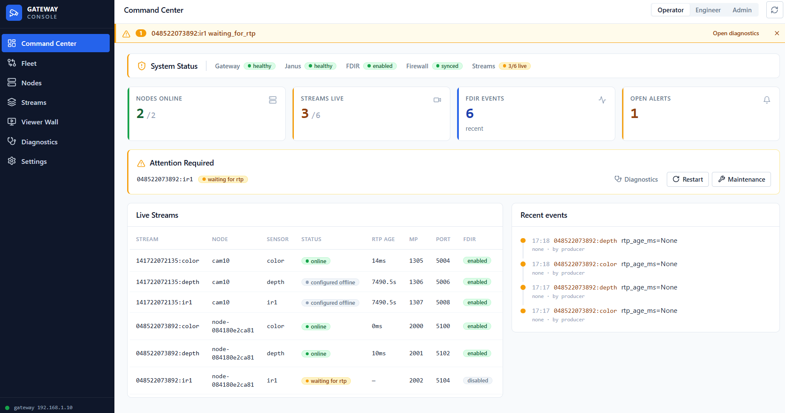
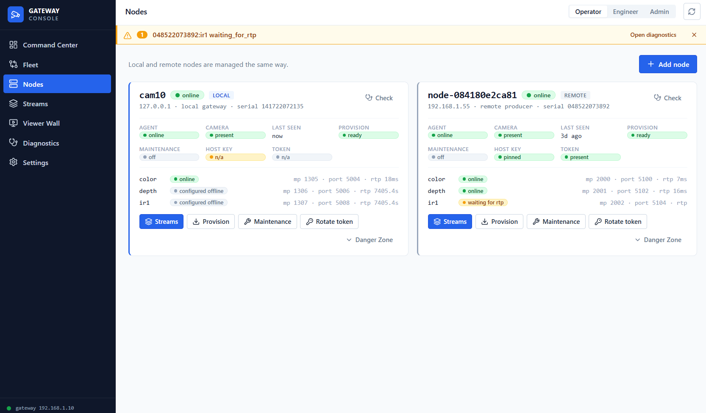

# janus-camera-stack

[](LICENSE)
[](https://www.python.org/downloads/)

**An end-to-end WebRTC camera streaming stack for robots and edge devices —
from the camera sensor all the way to the browser `<video>`.** Stream any
RealSense / V4L2 / RTSP camera — local *or* on a remote node — to the browser
over WebRTC, with a single control plane that owns the desired topology and
drives the cameras, encoders, and the WebRTC gateway toward it.

Beyond video, depth cameras are **interactive**: the viewer can request a
**single depth snapshot** (a full float32 depth frame, or an aligned RGBD frame)
and the **metric depth at any one pixel** — over two paths, a low-latency
**textroom data-channel** (click-to-measure, no extra round-trip to a server)
*and* a plain **REST API**. See [Depth queries](#depth-queries).

It is **application-agnostic**: joystick, gripper, mission HUDs etc. live in a
separate overlay layer, not in the stack.

> **New here?** Read [`docs/HANDOFF.md`](docs/HANDOFF.md) — the guided entry
> point (architecture map, the enforced invariants, where things live, how to
> change it safely). Replace `YOUR_ORG` in CI/CODEOWNERS with your GitHub org.

---

## The operator console

The stack ships a built-in web console (served at `/console.html`) — no separate
front-end to deploy. It is **role-aware** (Operator / Engineer / Admin) so a
read-only operator and a full admin see the same data with different powers.

**Command Center** — system status at a glance: gateway / Janus / FDIR / firewall
health, nodes-online and streams-live counters, open alerts, an *Attention
Required* banner with one-click Diagnostics / Restart / Maintenance, a live
streams table (status · RTP age · mountpoint · port · FDIR), and a recent-events
feed.



**Nodes** — *local and remote nodes are managed the same way.* Each node is a
card showing agent / camera / provision / maintenance / host-key / token health
and its per-sensor streams (mountpoint · port · live RTP age), with Provision,
Maintenance, Rotate-token and Danger-Zone actions. Adding a remote producer is a
single **Add node**.



The console also has **Fleet**, **Streams**, a **Viewer Wall** (multi-stream
grid), **Diagnostics**, and **Settings** views — all driven by the same admin API
that automation can call directly.

---

## How it works

The stack is layered. Each layer talks only to its neighbours through a narrow
contract (a scoped CLI or an HTTP boundary), so any layer can be replaced or
tested in isolation.

```
 L0  Camera            RealSense D4xx · USB/V4L2 · RTSP/IP camera
       │ frames (pyrealsense2 / V4L2)
 L2  Encoder           realsense-mux  →  rs-stream  (ffmpeg → H.264)
       │ RTP/H.264
 L3  Janus (SFU)       RTP mountpoint  →  WebRTC  (the media plane)
       │ WebRTC (DTLS-SRTP, ICE/STUN/TURN)
 ──   Browser player   vanilla-JS AutonomousPlayer  →  <video>
       ▲ back-channel (pub/sub over Janus textroom)
       │
 L4  Control plane     janus-camera-stack (FastAPI, :8900)  ◄── mostly here
       owns the DESIRED topology; drives L3/L2/L0 toward it; serves the
       operator console + the player; exposes the admin/viewer API.
```

### The control plane (L4) — `app/`

A FastAPI service (`main:app`, port `8900`). It does **not** transcode media —
it *orchestrates*. It owns which sensors/nodes should be streaming where, and
reconciles the live system (Janus mountpoints, encoders, firewall, node agents)
toward that desired state. Internally it is strictly layered and the boundaries
are **enforced by executable architecture-fitness tests** (`tests/test_architecture_fitness.py`):

```
app/routes/**       thin HTTP adapters (parse → call a use-case → map errors)
app/application/**   FastAPI-free use-cases (the orchestration logic)
app/services/**      adapters: Janus REST, the *-admin CLIs, state stores, probes
app/core/**          settings (one owner), admin/viewer auth, lifespan/events
app/config/**        PORTS / DEVICES network constants (one place)
```

### Nodes — local and remote are the *same thing*

A **node** is a host that produces camera RTP. The gateway's own host is the
local node (`cam10`); a remote node is any other host reachable over the LAN.
**Transport is the only difference** — both obey one contract
([`docs/NODE_CONTRACT.md`](docs/NODE_CONTRACT.md)):

- Nodes do **not** autostart their encoders. The **gateway converges** every
  *desired* stream when the node is reachable (this replaces per-node autostart
  and survives a node reboot — the gateway brings the streams back).
- Two independent axes per stream (never re-conflated):
  - **`desired_up`** — operator Start/Stop intent: is this stream wanted up? It
    drives the Janus mountpoint (the listener).
  - **`fdir.enabled`** — autonomous keep-alive: **FDIR owns recovery** (detect +
    recover + escalate). "FDIR off" = *not auto-managed* (mountpoint kept;
    restart by hand), not "recover silently".
- A remote node runs a small **node bundle** (`host_infra/node-bundle/`): an HTTP
  agent (`camera-node-agent`, token-authed) plus the same encoder pipeline. The
  gateway provisions, starts, stops, and recovers it over that boundary.

### The media plane — Janus (L3) + encoders (L2)

The encoder (`realsense-mux` + `rs-stream`, or `rtp-v4l2` / `rtp-rtsp`) pulls
frames, encodes H.264 with ffmpeg, and sends **RTP** to a **Janus** mountpoint.
Janus (the WebRTC SFU) fans that single RTP stream out to N browser viewers over
WebRTC. The gateway manages Janus through the `janus-admin` boundary CLI and a
REST probe; it never touches the media bytes. STUN/TURN (coturn) handle NAT
traversal for remote/internet viewers; ICE policy is operator-configurable.

### The browser player — `templates/player/`

A **dependency-free, bundler-free** JavaScript player (the `AutonomousPlayer`),
built as a small hexagonal app: a canonical **state machine** + pure
**policy/ports** core, with adapters for Janus, the DOM `<video>`, and stats.

Its recovery is **event-driven, not timer-driven**: it watches the real WebRTC
signals (`getStats` packets/frames-decoded deltas, ICE state, `<video>` events)
and only tears down + reconnects on a *genuine* failure (ICE failed, packets
actually stopped). A stream that is merely waiting for a keyframe over a
high-latency relay is marked *degraded* and ridden out — no destructive reconnect
storm. See [`docs/player_internals/`](docs/player_internals/).

A **back-channel SDK** (pub/sub over a Janus textroom) carries bidirectional data
(control commands, click-to-depth queries, joystick) without leaving the page.

### Depth queries

A depth camera is not just a video feed — you can **interrogate the depth on
demand**, through either of two paths:

- **Textroom data-channel (click-to-measure).** The browser publishes a
  `depth_query{x, y}` over the Janus textroom; the mux samples the *aligned*
  depth at that pixel and returns a `depth_result`, delivered back to **that
  session only** via SSE (`/depth_events`, per-session isolated). This is the
  click-on-the-video → "1.42 m" interaction, with no HTTP round-trip per click.
- **REST API** (same data, scriptable):

  | Endpoint | Returns |
  |---|---|
  | `GET /depth?x=&y=` | metric depth at a **single pixel** |
  | `GET /depth/frame` | a **full depth snapshot** (float32) |
  | `GET /depth/color_frame` | the matching colour frame (RGB24) |
  | `GET /depth/frame_color_overlay` | an **aligned RGBD** frame |

Both paths run the same RGB↔depth alignment, so a pixel clicked on the colour
image maps to the correct depth. Endpoints are viewer-auth gated and rate-limited.

---

## Quickstart

**Single host (Raspberry Pi 4/5 or generic Ubuntu/Debian):**

```bash
git clone <your-fork-url> janus-camera-stack && cd janus-camera-stack
./installer/probe.sh        # inspect host + cameras, no changes
sudo ./install.sh           # install services, generate secrets, bring up the stack
```

The installer detects OS/arch and attached cameras, handles `pyrealsense2`
(vendored wheel on arm64, PyPI on amd64), deploys the boundary CLIs + systemd
units, and starts everything. Full options + a manual path:
[`docs/INSTALL.md`](docs/INSTALL.md).

**Verify:**

```bash
curl http://localhost:8900/livez                  # → {"ok": true}
xdg-open http://localhost:8900/console.html        # operator console
```

Any V4L2 webcam works too (no RealSense needed) — see the USB tutorial in the docs.

---

## What you get / what's not included

**Included:** browser video viewer (low-latency `<video>`, ~80 ms steady-state) ·
event-driven autonomous reconnection · back-channel data SDK · on-demand depth
queries (full-frame snapshot + per-pixel metric depth, via data-channel **or** REST) for
RealSense · multi-sensor pipelines (color + depth + IR) · local **and** remote
nodes with gateway-driven recovery · FDIR auto-recovery · scoped boundary CLIs
(`camera-admin` / `encoder-admin` / `janus-admin`) · architecture-fitness tests ·
Prometheus metrics + structured logs + audit trail · operator console.

**Not included (bring your own):** the Janus Gateway install
([janus.conf.meetecho.com](https://janus.conf.meetecho.com)), a TURN server
(coturn or a managed one), TLS termination (nginx/Caddy in front), and a
front-end bundler (the player is intentionally vanilla JS).

---

## Configuration (no secrets in the repo)

All deployment-specific values are environment-driven; the defaults are
LAN/`localhost`-only and carry **no** real domains, IPs, or secrets:

| Concern | Env var | Default |
|---|---|---|
| Public web origin (CORS) | `CORS_ORIGIN_REGEX` | localhost + LAN `/24` |
| Public embed origin (CSP frame-ancestors) | `CSP_FRAME_ANCESTORS_LAN` | LAN nodes |
| Public WS origin (CSP connect-src) | `CSP_CONNECT_SRC_PUBLIC` | *(empty)* |
| Admin / internal / TURN secrets | `camera-secrets.env` | generated by installer |

Secrets live in `/etc/robot/camera-secrets.env` and `host_infra/secrets.yml`
(both git-ignored). Only `*.example` templates are committed.

---

## Documentation

Start at [`docs/HANDOFF.md`](docs/HANDOFF.md). Most-used entry points:

| Doc | Purpose |
|---|---|
| [`docs/ARCHITECTURE.md`](docs/ARCHITECTURE.md) | System architecture, layers, flow |
| [`docs/CONTRACT.md`](docs/CONTRACT.md) | L4 control-plane contract (boundaries, endpoints) |
| [`docs/NODE_CONTRACT.md`](docs/NODE_CONTRACT.md) | Node lifecycle — local + remote, the one contract |
| [`docs/INSTALL.md`](docs/INSTALL.md) · [`docs/DEPLOYMENT.md`](docs/DEPLOYMENT.md) | Install + deploy (incl. cloud) |
| [`docs/OPERATOR_RUNBOOK.md`](docs/OPERATOR_RUNBOOK.md) | "If X happens, do Y" |
| [`docs/ADAPTERS.md`](docs/ADAPTERS.md) | Add your own camera type |
| [`docs/player_internals/`](docs/player_internals/) | Player state machine + recovery |
| [`docs/KNOWN_LIMITATIONS.md`](docs/KNOWN_LIMITATIONS.md) | Honest limitations + backlog |

---

## Project layout

```
app/                 L4 control plane (FastAPI)
templates/player/    browser player (vanilla JS, hexagonal)
host_infra/          node bundle, encoder roles, Ansible
camera_bringup/      L0 camera tooling (reached only via camera-admin CLI)
installer/ deploy/   install.sh, Docker, Helm
docs/                architecture, contracts, runbooks, design notes
tests/               unit + integration + architecture-fitness guards
```

## Security · Contributing · License

- Report vulnerabilities per [`SECURITY.md`](SECURITY.md).
- Contributions welcome — see [`CONTRIBUTING.md`](CONTRIBUTING.md) and
  [`CODE_OF_CONDUCT.md`](CODE_OF_CONDUCT.md). The architecture-fitness tests must
  stay green (`pytest tests/ --ignore=tests/e2e`).
- Licensed under **Apache License 2.0** — see [`LICENSE`](LICENSE) and [`NOTICE`](NOTICE).

### Bundled dependency: `janus.js`

The backend serves Janus's browser library from `templates/janus.js`. It is not
vendored here — copy it from the [janus-gateway](https://github.com/meetecho/janus-gateway)
`html/` folder into `templates/janus.js` before first use.
