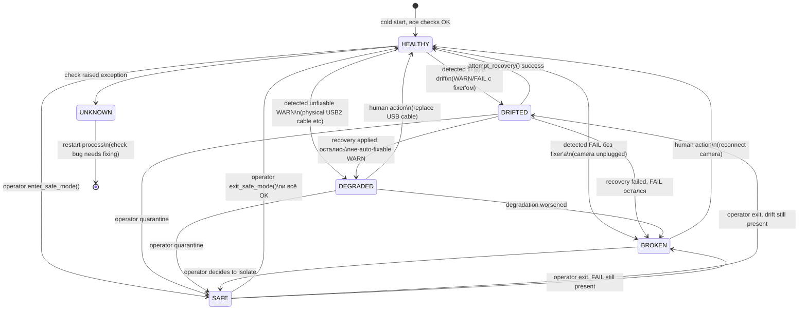

# L0 Contract — USB / kernel / udev / V4L2 layer

> Source of truth для того что L0 **обещает** вышестоящим слоям и что
> **требует** от инфраструктуры ниже. Если меняешь поведение слоя — обновляй
> этот документ И [api.py](api.py) одновременно.
>
> Programmatic interface: [`camera_bringup.api.L0`](api.py)

---

## 0. Owned resources — точные границы

L0 **владеет** (write+read, ничего за пределами L0 не пишет):

| Resource | Тип | L0 операции |
|---|---|---|
| `camera_bringup/` (весь package) | source code | own |
| `camera_bringup/.venv/` | dedicated Python venv с pyrealsense2 | own (создаёт через fixer) |
| `camera_bringup/hw_reset_realsense.py` | tool | own (since 2026-06-14, ранее жил в janus_camera_page/) |
| `camera_bringup/fixtures/*` | canonical config templates | own |
| `/var/lib/camera/fingerprint.json` | persistent baseline | own (write/read) |
| `/var/lib/camera/` (dir) | container | own (создаёт fixer) |
| `/etc/udev/rules.d/99-cam-rgb.rules` | system udev rule | own (canonical fixture) |
| `/etc/udev/rules.d/99-usb-nosuspend-d435i.rules` | system udev rule | own (canonical fixture) |
| `/etc/modprobe.d/uvcvideo.conf` | system module config | TODO: write fixer; сейчас read-only |
| `/sys/bus/usb/devices/N-N/power/*` | runtime sysfs | косвенно через udev rule (на boot+change) |

L0 **только читает** (никогда не пишет — explicit "borrowed" contract):

| Resource | Owner | Зачем читаем |
|---|---|---|
| `/sys/bus/usb/devices/*/idVendor`, `idProduct`, `bcdDevice`, `speed`, `bMaxPower` | kernel | discovery + identity |
| `/dev/video*`, `/dev/v4l/by-id/*` | kernel | symlink validation |
| `/sys/module/uvcvideo/parameters/*` | kernel | quirks verification |
| `/etc/robot/cam-rgb.env` | janus-camera-page (L4) | bandwidth math (нужны WIDTH×HEIGHT×FPS×PIX_FMT) |
| `/usr/local/bin/rs-stream.sh` | system installer (L2 prereq) | c10_smoke read-only inspection |
| `rs-stream@color.service` (LoadState) | system (L2) | c10_smoke read-only inspection |
| `ffmpeg` binary, codec list | system | c10_smoke read-only inspection |

**Что L0 НЕ трогает вообще:**
- Никаких файлов в `/opt/janus-camera-page/` (с migration 2026-06-14)
- Никаких файлов в shared venv `/opt/janus-camera-page/.venv/`
- Janus конфиги `/opt/janus/etc/janus/*`
- iptables / cloudflared / nginx
- ffmpeg config или encoder state

## 1. Scope (что входит в L0)

L0 покрывает путь от **физически подключённой USB-камеры** до **готовности
V4L2 capture node** (`/dev/cam-rgb`) для использования вышестоящим encoder'ом.

```
┌──────────────────────────────────────────────────────────────┐
│  Hardware (RealSense D435i)                                 │
│      │                                                      │
│      │ USB 2.0 cable                                        │
│      ▼                                                      │
│  USB port on Pi 5                                           │
│      │                                                      │
│      ▼                                                      │
│  xhci-hcd / uvcvideo / V4L2 driver stack                    │
│      │                                                      │
│      ▼                                                      │
│  /dev/videoN (kernel-assigned, нестабильный)                │
│      │                                                      │
│      ▼ udev rule (99-cam-rgb.rules)                         │
│      │                                                      │
│  /dev/cam-rgb (стабильный alias)  ◄─── EXIT POINT для L0    │
└──────────────────────────────────────────────────────────────┘
       │
       ▼
   L2 encoder (rs-stream@color.service) — НЕ часть L0
```

Что **НЕ** входит в L0:
- ffmpeg encoder (это L2)
- Janus / WebRTC (L3)
- network/NAT/TURN (L1)
- FastAPI camera control (L4)
- Browser/UI (L5)

---

## 2. Prerequisites (что L0 требует от системы ниже)

L0 предполагает что выполнено:

| Требование | Проверка |
|---|---|
| Pi 5 загружен, systemd running | `systemctl is-system-running` |
| udev daemon работает | `systemctl is-active systemd-udevd` |
| `/sys/bus/usb` mounted | `mount \| grep sysfs` |
| Kernel ≥ 6.x with uvcvideo support | `modinfo uvcvideo` |
| Python 3.10+ available | `python3 --version` |
| `.venv` в `/opt/janus-camera-page/.venv/` с pyrealsense2 | `/opt/janus-camera-page/.venv/bin/python -c "import pyrealsense2"` |
| sudo для apply ops (write `/etc/udev`, `/var/lib/camera`) | `sudo -v` |

Если хоть один из них не выполнен — L0 status = `UNKNOWN` или fixers упадут с FAILED.

---

## 3. Guarantees (что L0 обещает при status == HEALTHY)

Когда `L0.status() == LayerStatus.HEALTHY`, вышестоящие слои могут полагаться:

| Guarantee | Что значит конкретно | Источник check |
|---|---|---|
| `CAMERA_PRESENT` | Ровно одна D435i видна в `/sys/bus/usb/devices/` | `usb_enumerate` |
| `SINGLE_D435I` | Не больше одного устройства 8086:0b3a (иначе race за `/dev/cam-rgb`) | `usb_enumerate` |
| `USB_POWER_LOCKED_ON` | `power/control=on`, `power/autosuspend=-1`, `power/persist=0` | `usb_power` |
| `UVCVIDEO_QUIRKS_OK` | `uvcvideo` загружен с `nodrop=1 timeout=500 quirks=128`, modprobe.conf совпадает | `uvcvideo` |
| `UDEV_RULE_INSTALLED` | `/etc/udev/rules.d/99-cam-rgb.rules` совпадает с canonical fixture | `udev` |
| `DEV_CAM_RGB_VALID` | `/dev/cam-rgb` symlink, target имеет `ID_USB_INTERFACE_NUM=03` + `ID_V4L_CAPABILITIES=:capture:` | `dev_symlinks` |
| `V4L2_CAPTURE_READY` | V4L2 умеет YUYV 640x480@15fps; 3 test-кадра захвачены без error | `v4l2` |
| `FIRMWARE_NOT_TOO_OLD` | bcdDevice ≥ MIN_FIRMWARE_BCD (см. spec.py) | `firmware` |
| `BANDWIDTH_FITS_USB` | Текущий профиль из cam-rgb.env умещается в USB capacity ≤ 100% | `bandwidth` |
| `RESET_TOOLS_AVAILABLE` | `hw_reset_realsense.py` executable + pyrealsense2 importable + usbreset на PATH | `reset_tools` |
| `ENCODER_PREREQS_OK` | ffmpeg+libx264, `rs-stream.sh`, systemd unit `rs-stream@color.service` loaded | `smoke` |
| `IDENTITY_MATCHES_BASELINE` | Текущий serial совпадает с `/var/lib/camera/fingerprint.json` | `fingerprint` |

`L0.postconditions()` возвращает все 12 как dict[str, bool].

**Status `DEGRADED`**: guarantees выполнены, но есть WARN'ы которые L0 не умеет
автоматически устранить (например USB2 vs USB3 — физический кабель). Вышестоящие
слои могут работать, но не идеально.

**Status `DRIFTED`**: есть нарушение guarantee которое **может** быть починено
через `L0.attempt_recovery()`.

**Status `BROKEN`**: есть FAIL который L0 не починит сам. Вышестоящие слои
запускать **нельзя**.

---

## 4. API (programmatic interface)

**Единственный импорт** для L1+:
```python
from camera_bringup import L0, LayerStatus
```

`__all__` пакета также экспортирует typed dataclasses:
`Identity`, `CalibrationIntrinsics`, `StreamProfile`, `Guarantees`, `Snapshot`, `RecoveryResult`.

### 4.1 Quick start — типовые шаблоны

**Pattern A: Готова ли L0?**
```python
from camera_bringup import L0

if L0.is_ready():           # HEALTHY or DEGRADED
    start_my_pipeline()
elif L0.is_usable():        # DRIFTED — auto-fix availible
    L0.attempt_recovery()
else:                       # BROKEN | UNKNOWN | SAFE
    raise CameraNotReady(L0.requires_human())
```

**Pattern B: Параметры для encoder (L2)**
```python
profile = L0.stream_profile()
# StreamProfile(device_path='/dev/cam-rgb', pixel_format='YUYV',
#               width=640, height=480, fps=15)

subprocess.run([
    "ffmpeg", "-f", "v4l2",
    "-input_format", profile.pixel_format.lower(),
    "-video_size", f"{profile.width}x{profile.height}",
    "-framerate", str(profile.fps),
    "-i", profile.device_path,
    ...
])
```

**Pattern C: CV pipeline (3D reconstruction)**
```python
import numpy as np

cal = L0.calibration("color")    # CalibrationIntrinsics
if cal is None:
    raise NoCalibration("baseline missing — run apply --only fingerprint")

K = np.array(cal.to_camera_matrix())   # 3x3 intrinsics matrix
distortion = np.array(cal.coeffs)

undistorted = cv2.undistort(frame, K, distortion)
```

**Pattern D: Granular guarantee check**
```python
g = L0.guarantees()
if not g.USB_POWER_LOCKED_ON:
    log.warning("USB autosuspend may interrupt long sessions")
if not g.CAMERA_PRESENT:
    raise NoCamera()
# Все 12 guarantees как typed attributes
```

**Pattern E: Diagnostic snapshot**
```python
snap = L0.snapshot()
# Snapshot(status=HEALTHY, identity=Identity(serial=...),
#          checks_total=11, status_counts={...}, requires_human=[])
log.info("L0 state", extra={"camera_state": snap.to_dict()})
```

### 4.2 Полный method reference

| Method | Returns | Use case |
|---|---|---|
| `L0.status()` | `LayerStatus` enum | "Какое состояние слоя?" |
| `L0.is_ready()` | `bool` | "Можно работать?" (HEALTHY/DEGRADED) |
| `L0.is_usable()` | `bool` | "Что-то работает?" (всё кроме BROKEN/UNKNOWN/SAFE) |
| `L0.identity()` | `Identity \| None` | Current camera identity (live) |
| `L0.baseline_identity()` | `dict \| None` | Полный baseline JSON (с calibration + HMAC) |
| `L0.stream_profile()` | `StreamProfile` | Параметры для encoder |
| `L0.calibration(stream)` | `CalibrationIntrinsics \| None` | Intrinsics для CV |
| `L0.available_calibrations()` | `list[str]` | Какие stream types в baseline |
| `L0.guarantees()` | `Guarantees` (typed) | 12 named bool flags |
| `L0.postconditions()` | `Guarantees` | Alias для guarantees() (legacy name) |
| `L0.requires_human()` | `list[str]` | Что НЕ auto-fixable |
| `L0.attempt_recovery(dry_run)` | `RecoveryResult` | Запустить fixers |
| `L0.snapshot()` | `Snapshot` (typed) | Full state for UI/log |
| `L0.summary()` | `dict` | Alias для snapshot().to_dict() (legacy) |
| `L0.invalidate_cache()` | `None` | Force refresh после external apply |

### 4.3 Typed return shapes

```python
@dataclass(frozen=True)
class Identity:
    vendor_id: str          # "8086"
    product_id: str         # "0b3a"
    serial: str | None      # "141722072135"
    firmware: str | None    # "5.16.0.1"
    product_name: str | None    # "Intel RealSense D435I"
    product_line: str | None    # "D400"
    usb_type: str | None    # "2.1"

@dataclass(frozen=True)
class CalibrationIntrinsics:
    sensor: str             # "RGB Camera" / "Stereo Module"
    width: int
    height: int
    fx: float               # focal length x
    fy: float               # focal length y
    ppx: float              # principal point x
    ppy: float              # principal point y
    model: str              # "brown_conrady" / "inverse_brown_conrady"
    coeffs: tuple[float, ...]   # 5 distortion coefficients

    def to_camera_matrix(self) -> list[list[float]]: ...    # 3x3 K matrix

@dataclass(frozen=True)
class StreamProfile:
    device_path: str        # "/dev/cam-rgb"
    pixel_format: str       # "YUYV"
    width: int
    height: int
    fps: int

    def encoder_kwargs(self) -> dict: ...   # для ffmpeg-style invocation

@dataclass(frozen=True)
class Guarantees:
    CAMERA_PRESENT: bool
    SINGLE_D435I: bool
    USB_POWER_LOCKED_ON: bool
    ... 12 total flags ...

    def __getitem__(self, key: str) -> bool: ...    # dict-style compat
    def all_satisfied(self) -> bool: ...
    def unsatisfied(self) -> list[str]: ...

@dataclass(frozen=True)
class Snapshot:
    layer: str              # "L0_usb_kernel_udev_v4l2"
    status: LayerStatus
    checks_total: int
    status_counts: dict[str, int]   # {"OK": 10, "WARN": 1, "FAIL": 0, ...}
    identity: Identity | None
    baseline_serial: str | None
    requires_human: list[str]

    def to_dict(self) -> dict: ...

@dataclass
class RecoveryResult:
    attempted: bool
    applied_fixers: list[str]
    skipped_fixers: list[str]
    failed_fixers: list[str]
    unfixed_fixers: list[str]
    remaining_issues: list[str]
    requires_human: list[str]

    fully_recovered: bool   # @property
    needs_attention: bool   # @property
```

---

## 5. Failure modes & escalation

| Условие | Auto-fixable? | Действие |
|---|---|---|
| Camera physically missing | ❌ | human: check cable/power/USB port |
| Multiple D435i found | ❌ | human: оставить одну, или реализовать serial-based aliases (TODO) |
| Camera serial mismatch (swap) | ⚠️ только с подтверждением | human: подтвердить swap → `apply --only fingerprint` (примет current как новый baseline) |
| Firmware too old | ❌ | human: `rs-fw-update -f <firmware.bin>` |
| USB2 instead of USB3 | ❌ | human: replace cable / move to USB3 port |
| Bandwidth exceeded | ❌ | human: уменьшить fps/resolution в `/etc/robot/cam-rgb.env` |
| USB power drift (auto/persist=1) | ✅ | `attempt_recovery()` через `f02_usb_power` |
| pyrealsense2 missing | ✅ | `attempt_recovery()` через `f09_reset_tools` |
| `hw_reset_realsense.py` не executable | ✅ | то же |
| Fingerprint baseline отсутствует | ✅ | `attempt_recovery()` через `f11_fingerprint` (создаст baseline) |
| udev rule modified/deleted | ⚠️ TODO | пока вручную; fixer запланирован |
| uvcvideo quirks drift | ⚠️ TODO | пока вручную |

---

## 6. State transitions



### State semantics summary

| State | Stream работает? | apply разрешён? | Action |
|---|---|---|---|
| **HEALTHY** | ✓ | ✓ | nothing |
| **DRIFTED** | ✓ (но скоро может сломаться) | ✓ | run `attempt_recovery()` |
| **DEGRADED** | ✓ (но suboptimal) | ✓ | `requires_human()` — human eyes |
| **SAFE** | depends (frozen) | ✗ (blocked) | wait for `exit_safe_mode()` |
| **BROKEN** | ✗ | ✓ (но fixer'ы не сработают) | `requires_human()` — must intervene |
| **UNKNOWN** | unknown | not safe | investigate check exception |

### RTO (Recovery Time Objectives)

| Transition | Typical duration | Mechanism |
|---|---|---|
| HEALTHY → DRIFTED detection | ≤ cache TTL (5s) | passive (на следующем `status()` call) |
| DRIFTED → HEALTHY via apply | 1-10s | depends on fixer (usb_power ~3s, fingerprint ~1s) |
| BROKEN → HEALTHY | manual + reboot if needed | physical action required |
| SAFE → any | manual exit | one CLI command |

### Failure detection latency

- **Polling-based** (current): `L0.status()` запускает все 11 checks; cached
  TTL=5s. Worst-case latency detection = 5s + check duration.
- **Push-based** (future): прицепление к udev events / journalctl для
  instant detection — TODO.

**Возможные переходы**:
- `HEALTHY → DRIFTED`: что-то изменилось (drift power settings, etc.)
- `DRIFTED → HEALTHY`: успешный `attempt_recovery()`
- `DRIFTED → DEGRADED`: recovery применился, но осталось не-auto-fixable
- `DEGRADED → HEALTHY`: человек устранил физическую проблему (заменил кабель и т.п.)
- `* → BROKEN`: появился FAIL без fixer (камера unplugged)
- `BROKEN → HEALTHY`: человек восстановил физическую часть
- `* → UNKNOWN`: exception в check (баг в bringup, не в системе)

---

## 7. Usage patterns

### Pattern A: «Готов ли L0 для запуска моего слоя?»

```python
from camera_bringup.api import L0, LayerStatus

status = L0.status()
if status == LayerStatus.HEALTHY:
    pass   # green light
elif status == LayerStatus.DEGRADED:
    log.warning("L0 degraded but functional: %s", L0.requires_human())
    # можно работать
elif status == LayerStatus.DRIFTED:
    log.info("L0 drift — trying auto-recovery")
    result = L0.attempt_recovery()
    if result.fully_recovered or L0.status() in {LayerStatus.HEALTHY, LayerStatus.DEGRADED}:
        pass  # recovered, можно работать
    else:
        raise CameraNotReady("L0 recovery insufficient", remaining=result.remaining_issues)
else:  # BROKEN or UNKNOWN
    raise CameraNotReady(f"L0 status={status}", requires_human=L0.requires_human())
```

### Pattern B: «Проверить конкретную гарантию»

```python
postconds = L0.postconditions()

if not postconds["USB_POWER_LOCKED_ON"]:
    log.error("Cannot start sustained recording — USB autosuspend may interrupt")

if not postconds["RESET_TOOLS_AVAILABLE"]:
    log.warning("FDIR ladder will skip USB_RESET escalation step")
```

### Pattern C: «Cron-based drift detection»

```bash
# /etc/cron.hourly/camera-drift-check
#!/bin/bash
python3 -m camera_bringup verify --json \
    > /var/lib/node_exporter/textfile/camera_bringup.prom
```

Затем Prometheus alert: `camera_bringup_totals{status="FAIL"} > 0`.

### Pattern D: «UI shows current camera state»

```python
import json
summary = L0.summary()
return JSONResponse(summary)
```

---

## 8. Versioning & compatibility

- Эта спецификация = **v1**
- `LayerStatus`, `GUARANTEES`, method signatures — публичный API. Breaking
  changes требуют major version bump + миграционный документ.
- `CheckResult.details`, internal fixers — НЕ публичный API. Могут меняться.
- `fingerprint.json` schema versioned (`schema_version` field), сейчас 1.

---

## 11. Multi-instance pattern (Batch 4')

L0 = **template**. Каждая физическая камера = **instance** этого template'а
с собственным TOML-конфигом, фингерпринтом, lock-файлом, udev rule.

### Архитектура

```
                      ┌──────────────────────────┐
                      │  L0 = TEMPLATE (этот pkg)│
                      │  checks/, fixers/, api/  │
                      │  spec.py загружает       │
                      │  ACTIVE_INSTANCE         │
                      └────────────┬─────────────┘
                                   │
              ┌────────────────────┼─────────────────────┐
              │                    │                     │
       ┌──────▼──────┐      ┌──────▼──────┐       ┌──────▼──────┐
       │ instance:   │      │ instance:   │       │ instance:   │
       │ cam-rgb     │      │ cam-rear    │       │ cam-thermal │
       │ (D435i)     │      │ (D435i #2)  │       │ (FLIR)      │
       │ port 2-2    │      │ port 3-1    │       │ port 4-1    │
       └─────────────┘      └─────────────┘       └─────────────┘
       /dev/cam-rgb         /dev/cam-rear         /dev/cam-thermal
       fingerprint:          fingerprint:           fingerprint:
       cam-rgb.json          cam-rear.json          cam-thermal.json
       lock:                 lock:                  lock:
       cam-rgb.lock          cam-rear.lock          cam-thermal.lock
       udev rule:            udev rule:             udev rule:
       99-cam-rgb.rules      99-cam-rear.rules      99-cam-thermal.rules
```

### Instance lifecycle

1. **Create**: положить `instances/<id>.toml` (см. `instances/cam-rgb.toml` как пример)
2. **Activate**: `CAMERA_BRINGUP_INSTANCE=<id> python3 -m camera_bringup verify`
   ИЛИ `python3 -m camera_bringup --instance <id> verify`
3. **Baseline**: `sudo python3 -m camera_bringup --instance <id> apply --only fingerprint`
4. **Install udev**: `sudo python3 -m camera_bringup --instance <id> apply --only udev`
5. **Operate**: дальше как обычно, всё per-instance изолированно

### Что общее vs per-instance

| Ресурс | Scope |
|---|---|
| `/dev/<symlink>` | per-instance (cam-rgb, cam-rear) |
| `/var/lib/camera/<id>.json` (fingerprint) | per-instance |
| `/run/camera_bringup-<id>.lock` (apply lock) | per-instance |
| `/etc/udev/rules.d/99-<id>.rules` (camera-specific udev) | per-instance |
| `/etc/udev/rules.d/99-usb-nosuspend-d435i.rules` (power) | per camera class (vendor:product) |
| `/etc/modprobe.d/uvcvideo.conf` | system-wide |
| `camera_bringup/.venv/` (pyrealsense2) | shared (один venv для всех instances) |
| `camera_bringup/hw_reset_realsense.py` | shared |

### Discriminator для D435i (USB iSerial = 0)

D435i не имеет USB string descriptor для iSerial. Чтобы udev мог различать
N штук D435i на одном хосте — используется `usb_port_hint` в InstanceSpec:

```toml
[hardware]
usb_port_hint = "2-2"   # этот instance matches только когда камера в port 2-2
```

`render_udev_rule()` добавляет `KERNELS=="2-2"` к match selectors. Стабильно
пока камеры физически в фиксированных портах. Real serial всё равно
сохраняется в fingerprint для post-baseline validation.

### Migration: single → multi instance

После Batch 4' рефакторинга **текущая камера на .10 = instance "cam-rgb"**
(default). Никаких breaking changes:
- `python3 -m camera_bringup verify` работает как раньше
- Старые ENV overrides всё ещё работают
- Контракт L0 v1 не сломан

Для добавления второй камеры:
1. Создать `instances/cam-rear.toml` с правильным port_hint
2. `sudo python3 -m camera_bringup --instance cam-rear apply --yes-root`
3. Готово — две instance работают изолированно

## 10. Migration history

### 2026-06-14 (later): Multi-instance pattern (Batch 4')

- Добавлен `instance.py` с InstanceSpec dataclass и TOML loader
- `spec.py` теперь loads ACTIVE_INSTANCE при import (default cam-rgb)
- udev rule больше не static fixture — генерируется через
  `ACTIVE_INSTANCE.render_udev_rule()`
- fingerprint path по умолчанию per-instance: `/var/lib/camera/<id>.json`
- lock file per-instance: `/run/camera_bringup-<id>.lock`
- Добавлен `f04_udev` fixer для регенерации udev rule
- CLI: `--instance ID` или ENV `CAMERA_BRINGUP_INSTANCE`
- Migration текущего .10 = fingerprint copy старого пути в новый

### 2026-06-14: hw_reset_realsense + L0 venv moved into camera_bringup/

Раньше:
- `hw_reset_realsense.py` жил в `/opt/janus-camera-page/` (L4 path)
- pyrealsense2 был установлен в shared `/opt/janus-camera-page/.venv/`
- f09_reset_tools модифицировал оба ресурса = boundary leak

Теперь:
- `hw_reset_realsense.py` живёт в `/opt/janus-camera-page/camera_bringup/` (L0 own)
- pyrealsense2 в dedicated `/opt/janus-camera-page/camera_bringup/.venv/` (L0 own)
- f09_reset_tools только трогает L0-owned ресурсы
- Старый файл в `janus_camera_page/` помечен `DEPRECATED` (но не удалён — может
  использоваться `realsense-failsafe.service` на .55; удаляется после
  координированного апдейта .55)

Compatibility:
- На .10 verify+apply работают без обращения к старому пути
- На .55 `realsense-failsafe.service` продолжает вызывать старый путь до
  отдельного PR который обновит и его

## 9. Known limitations (текущие)

См. также [README.md#known-issues](README.md#known-issues).

1. **Reboot/replug test не проведён** — теоретически работает (udev rule
   matches на add+change), эмпирически не верифицировано (remote work risk).

2. **Multi-camera setup не поддерживается** — на 2+ D435i `usb_enumerate`
   возвращает FAIL. Для multi-camera нужен udev `RUN+=` хелпер с
   serial-extraction через pyrealsense2.

3. **`firmware` check измеряет `bcdDevice`** (USB descriptor), а не реальную
   firmware. `fingerprint` использует правильный путь через pyrealsense2.
   TODO: переделать `firmware` check.

4. **Не все checks имеют fixers**. Покрытие сейчас 3 из 11. Остальные —
   manual recovery + WARN/FAIL в verify.
