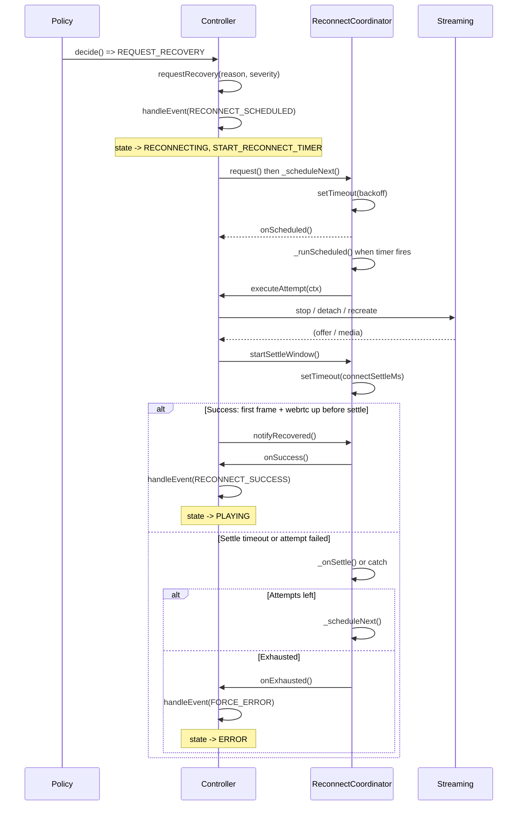

# Reconnect flow

This document describes the reconnect sequence: from policy detecting a failure to either recovery success or transition to ERROR. It is referenced by [SAFETY_LAWS.md](SAFETY_LAWS.md) (L11/L12/L13, L14/L15).

## Overview

1. **Policy** (ConnectionPolicy) detects a failure (ICE failed, no frames, WebRTC down, etc.) and returns `REQUEST_RECOVERY` with a reason and severity.
2. **Controller** calls `requestRecovery(reason, severity)`. If the current state allows it (e.g. PLAYING or CONNECTING), the state machine transitions to **RECONNECTING** and emits the **START_RECONNECT_TIMER** action.
3. **ReconnectCoordinator** receives the scheduling request (via the action executor). It respects **L11** (at most one reconnect in progress): if already scheduled or in-flight, the request is coalesced/ignored. It schedules a timer with **backoff** (L12: attempts are bounded by `maxReconnectAttempts`).
4. When the backoff timer fires, the coordinator calls **executeAttempt** (injected by the controller). The controller performs the concrete recovery step (SOFT_RESTART, REATTACH_PLUGIN, or RECREATE_SESSION) and then starts the watchdog.
5. When the streaming layer signals that the attempt has started (e.g. streaming offer received), the controller dispatches an event that leads to **startSettleWindow()**. The coordinator starts a **settle window** (`connectSettleMs`). If **notifyRecovered()** is called before the window expires (webrtc up + first frame), recovery succeeds.
6. On success: coordinator calls **onSuccess** → controller dispatches RECONNECT_SUCCESS → state goes to PLAYING; attempt counter is reset.
7. On failure (settle timeout, or attempt threw): coordinator calls **_scheduleNext** for another attempt, or if **maxReconnectAttempts** is reached, **onExhausted** → controller transitions to **ERROR** (L13).

Timers are owned by the RECONNECTING state (L14). Leaving RECONNECTING (IDLE or ERROR) cancels all timers via CANCEL_ALL_TIMERS and ReconnectCoordinator.reset() (L15).

## Lifecycle invariants (session / handle / PC)

**Invariant A — One generation, one set of live objects.**  
One "generation" (session token) corresponds to one set of live objects. When generation N+1 starts (reconnect or new connect), objects for generation N must be fully torn down: streaming PeerConnection closed (`pc.close()`), plugin handle detached, session destroyed if needed. Any events from generation N must be dropped (e.g. `EVENT_DROPPED`, stale token checks).

**Invariant B — No watch() before teardown is confirmed.**  
Do not call `watch()` until the previous watch has been torn down. The streaming plugin supports `stop` (teardown) and `switch` (change mountpoint without teardown). After `stop`, the client must wait for Janus to signal cleanup (e.g. `oncleanup`) before starting a new `watch()` or reusing the handle. Otherwise the server may still consider the client "watching" and return 460 (Already watching) or cause DTLS/race issues.

See [DIAGNOSTICS.md](docs/DIAGNOSTICS.md) for webrtc-internals, WebSocket, and test-matrix checklists.

## Sequence diagram

## Limits and backoff

- **MAX_RECONNECT_ATTEMPTS** (core/codes.js): default cap (e.g. 12). Config `maxReconnectAttempts` is clamped to [3, 50] and defaults to this value.
- **Backoff**: `backoffBaseMs`, `backoffMaxMs`, `backoffJitterRatio` (and optional seed) control delay between attempts. Jitter is deterministic when a seed is passed (see core/backoff.js).
- **Exhausted**: When the attempt limit is reached, the coordinator logs `reconnect_exhausted` (attempt, reason, severity, token), calls `onExhausted`, and does not schedule further attempts. The controller transitions to ERROR once; all timers are cleared (L15). No background reschedule until the user triggers Retry.

## Page visibility (industrial behaviour)

When `visibilityAwareReconnect` is true (default):

- **While tab is hidden**: `shouldContinue` is false, so the coordinator does not schedule the next attempt after a failure. Attempts are not “burned” while the user is on another tab; the client stays in RECONNECTING with no timer.
- **When tab becomes visible again**:
  - If state is **ERROR** (e.g. reconnect exhausted while tab was hidden), the controller calls `retry()` once: full reset and CONNECTING, so the stream can come back without a manual Retry click.
  - If state is **RECONNECTING** and scheduling was paused (no timer), the controller calls `_reconnect.resumeIfPending()` so the next attempt is scheduled with the full attempt budget again.

This avoids exhausting all N attempts in the background and gives the user a working stream when they return to the tab. Disable with `data-visibility-aware-reconnect="false"` on the body or the query flag.

## Performance

Meaningful metrics to observe:

- **Time to first frame after reconnect starts**: from the moment RECONNECTING is entered until the first frame is received and RECONNECT_SUCCESS is dispatched. This is dominated by backoff delay, network/Janus latency, and settle window.
- **Settle window length** (`connectSettleMs`): how long the coordinator waits for `notifyRecovered()` after `startSettleWindow()` before treating the attempt as failed.
- **Cumulative time over N attempts**: with deterministic backoff (jitter 0), the sum of delays for attempts 1..N is fixed for given config; with jitter enabled, it varies.

Unit tests in [run_controller_tests.js](../tests/run_controller_tests.js) use a fake clock, so timing in tests is deterministic and reproducible. For real-world measurement in the browser, log the events `reconnect_scheduled` (with `delay`), `reconnect_success`, and `reconnect_exhausted` to derive attempt counts and elapsed time.

## Error recovery examples

Default severity and typical recovery actions are derived from [recovery_map.js](app/recovery_map.js) (reason → default severity) and [recovery_policy.js](core/recovery_policy.js) (attempt + severity → action).

| Reason | Default severity | Typical action (by attempt ladder) |
|--------|------------------|-----------------------------------|
| ICE_FAILED | HARD | RECREATE_SESSION (immediately) |
| SESSION_RESET | HARD | RECREATE_SESSION |
| WEBRTC_DOWN | MEDIUM | SOFT_RESTART → REATTACH_PLUGIN → RECREATE_SESSION |
| ICE_DISCONNECTED_GRACE | MEDIUM | SOFT_RESTART → … |
| HANGUP | MEDIUM | SOFT_RESTART → … |
| NO_FRAMES | MEDIUM | SOFT_RESTART → … |
| TRACK_MUTED | MEDIUM | SOFT_RESTART → … |
| JANUS_ERROR | MEDIUM | SOFT_RESTART → … |
| ALREADY_WATCHING (460) | HARD | RECREATE_SESSION (immediately) |

**Example 1 — ICE failure:** Policy reports ICE_FAILED with severity HARD. The coordinator runs the first attempt; `decideRecoveryAction(attempt, HARD, cfg)` returns RECREATE_SESSION regardless of attempt number. The controller calls `streaming.recreate()`. If the session comes back and the user gets an offer and first frame within the settle window, `notifyRecovered()` is called and state returns to PLAYING.

**Example 2 — No frames (soft ladder):** Policy reports NO_FRAMES with severity MEDIUM. Early attempts use SOFT_RESTART (stop → watch again). If that does not yield a frame within the settle window, the next attempt may be REATTACH_PLUGIN, then RECREATE_SESSION, according to `maxWatchRetries` and `maxReattachRetries`. Each attempt is delayed by backoff; after `maxReconnectAttempts`, the coordinator calls onExhausted and the controller transitions to ERROR.
