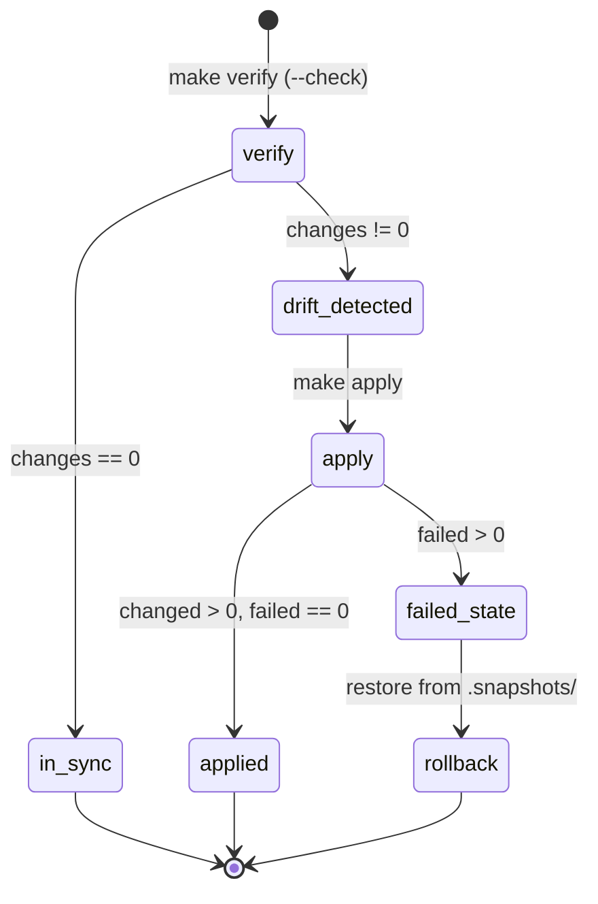

# host_infra contract — L1 + L2 + L3 (Ansible IaC)

> **Tool**: Ansible (de facto IaC standard для 1-50 hosts).
> **Code**: ~600 LOC YAML + 220 LOC bash/Python scripts.
> **Scope**: declarative host OS state + janus runtime coordination.
> **Tests**: 30 unit (pytest), идемпотентный apply (`make verify` → 0 changes).

## Architecture invariants

### Single source of truth (`cameras:` dict)

Camera contract данные живут ровно в одном месте — `group_vars/all.yml`:

```yaml
cameras:
  cam-rgb:
    instance: cam-rgb
    block_name: rgb-rtp
    rtp_port: 5004
    rtcp_port: 5005
    mountpoint_id: 1305
    codec: h264
    fmtp: "profile-level-id=42e01f;..."
    default_*: ...  # bitrate/fps/width/...
```

Encoder env + janus jcfg оба template'ятся из этого dict. Изменение одного
поля → один `make apply` → синхронизация encoder ↔ janus. Drift невозможен
(validate_cam_env.sh проверяет contract.env vs group_vars).

### Multi-writer coordination (flock на `/var/lock/janus-jcfg.lock`)

ТРИ независимых писателя мутируют `/opt/janus/etc/janus/janus.jcfg`:

| Writer | Schedule | What patches |
|---|---|---|
| `/etc/robot/update-nat-mapping.sh` | cron */15min | `nat_1_1_mapping` (public IP) |
| `/usr/local/bin/janus-turn-rotator` | systemd daily | `turn_user`, `turn_pwd` (HMAC rotation) |
| L4 `patch_janus_cfg_with_nat()` | admin endpoint | whole `# BEGIN NAT AUTO`…`# END` block |

Все acquire `LOCK_EX` на `/var/lock/janus-jcfg.lock` (60s timeout). Read-modify-write
atomic в lock. Без lock — race (один writer rewrite'ает whole block, другой
patches single line → одна mutation теряется).

Реализация: bash `flock 200`, Python `fcntl.LOCK_EX` через `jcfg_lock()` context manager.

### Secrets pattern (`secrets.yml` gitignored)

Secrets разделены от structural data:
- `group_vars/all.yml` — структура (ports, mountpoint IDs, codec, defaults). В git.
- `secrets.yml` — реальные secret values. **Gitignored**.
- `secrets.yml.example` — schema с `<SET-ME>` placeholders. В git.

`site.yml` loads `secrets.yml` через `vars_files`. Если файл отсутствует — apply упадёт.

```yaml
# secrets.yml structure
janus_streaming_admin_key: "<random 256-bit>"
cameras_secrets:
  cam-rgb: "<random 256-bit>"
janus_textroom_secret: "<random 256-bit>"
```

## What's managed

### L1 — Host infrastructure

| Resource | Role | Why |
|---|---|---|
| `net.ipv4.ip_forward = 1` | sysctl | required для MASQUERADE |
| `net.ipv4.conf.*.rp_filter = 0` | sysctl | required для MASQUERADE source verification |
| `net.netfilter.nf_conntrack_udp_timeout_stream = 180` | sysctl | WebRTC long-lived UDP sessions (default 30s рвёт стрим) |
| `net.netfilter.nf_conntrack_udp_timeout = 60` | sysctl | same |
| `iptables NAT POSTROUTING MASQUERADE 192.168.1.0/24` | network | depth node .55 → internet uplink |
| `iptables FORWARD br0 ↔ wlan0` | network | allow forward traffic |
| `iptables-persistent` saved | network | survives reboot |
| `camera-nat.service` disabled | network | Ansible теперь owns sysctl + iptables |

### L2 — Encoder (rtp-rgb pipeline)

| Resource | Role | Mutability |
|---|---|---|
| `/etc/systemd/system/rtp-rgb@.service` + drop-ins | encoder | immutable |
| `/usr/local/bin/rtp-rgb.sh` | encoder | immutable |
| `/usr/local/bin/cam-wait-capture.sh` | encoder | immutable |
| `/etc/robot/cam-rgb.contract.env` | encoder | **Ansible-owned** (`force: true`) — PORT must match janus jcfg |
| `/etc/robot/cam-rgb.tuning.env` | encoder | **operator-mutable** (`force: false`) — bitrate/fps/etc |

Validator `scripts/validate_cam_env.sh` проверяет:
- `contract.env` PORT matches `group_vars cameras.X.rtp_port` (drift detection)
- `tuning.env` values в sane ranges (WIDTH/HEIGHT/FPS/BITRATE/PRESET валидны)
- Запускается в `make verify`

### L3 — Janus WebRTC Gateway

| Resource | Role | Mutability |
|---|---|---|
| `/etc/systemd/system/janus.service` + drop-ins | janus | immutable |
| `/opt/janus/etc/janus/janus.transport.{http,websockets}.jcfg` | janus | immutable (static config) |
| `/opt/janus/etc/janus/janus.plugin.streaming.jcfg` | janus | **template'd** from `cameras` dict + `cameras_secrets` |
| `/opt/janus/etc/janus/janus.plugin.textroom.jcfg` | janus | **template'd** from `janus_textroom_secret`. Mode `0640` (contains secret) |
| `/etc/robot/update-nat-mapping.sh` | janus | immutable (hardened bash, flock + atomic write) |
| `/usr/local/bin/janus-turn-rotator` | janus | immutable (pure-stdlib Python, jcfg_lock + atomic_write) |
| `/etc/systemd/system/janus-turn-rotator.{service,timer}` | janus | immutable (daily check) |
| cron entry `*/15` for update-nat-mapping.sh | janus | declarative via ansible.builtin.cron |
| `janus-ip-refresh.timer` disabled | janus | legacy template-regen — was time bomb |

**NOT** managed by Ansible (runtime-mutable, coordinated через flock):
- `/opt/janus/etc/janus/janus.jcfg` — `nat_1_1_mapping`, `turn_user`, `turn_pwd`, NAT block
  - Writers: NAT updater, TURN rotator, L4 admin API (see "Multi-writer coordination" above)

### Known issues

| Issue | Severity | Status |
|---|---|---|
| ~~TURN credentials expire 2027-03-24~~ | ✅ RESOLVED | Daily rotation via janus-turn-rotator + systemd timer. Rotated сегодня → expiry 2027-06-14 (+1 year) |
| ~~Streaming mountpoint `secret = "changeme"`~~ | ✅ RESOLVED | Rotated to 256-bit random (cameras_secrets[name] из secrets.yml) |
| ~~Streaming `admin_key = "stream-admin-123"`~~ | ✅ RESOLVED | Rotated to 256-bit random (janus_streaming_admin_key из secrets.yml) |
| ~~Textroom `secret` reused sudo password~~ | ✅ RESOLVED | Rotated to 256-bit unique (janus_textroom_secret из secrets.yml) |
| ~~Two competing NAT updaters~~ | ✅ RESOLVED | systemd timer disabled, cron canonical (now hardened с flock) |
| ~~Multi-writer race на janus.jcfg~~ | ✅ RESOLVED | flock coordination (3 writers) |
| ~~L4 unprotected jcfg writer~~ | ✅ RESOLVED | L4 _jcfg_lock() shares same flock |
| Sudo password reuse (`$SHARED_PASS`) — sudo + MQTT | MEDIUM | Out of scope — manual operator rotation |
| `janus.jcfg.tpl` template unused (currently in-place patch) | LOW | OK для current scale; consider template-regen pattern если нужен полный declarative |
| MQTT bridge password in docker env | LOW | Docker scope, отдельная задача |

## What's NOT managed (boundaries)

| Resource | Owner | Why not us |
|---|---|---|
| `/dev/cam-rgb` symlink | L0 camera_bringup | Hardware-level concern (udev rule) |
| `/etc/udev/rules.d/99-cam-*.rules` | L0 camera_bringup | Same |
| `/etc/modprobe.d/uvcvideo.conf` | L0 camera_bringup | Same |
| WiFi credentials | Manual | Sensitive, не в git, оператор настраивает |
| Docker stack (frontend, api-gateway, robot) | docker-compose | Separate orchestration layer |
| L4 FastAPI app (janus_camera_page) | Own systemd unit | Not Ansible-managed (yet — pending L4 refactor) |
| ROS / robot business logic | Separate concerns | Different lifecycle |

## Layer boundaries — invariant

Cross-layer **reads** OK, cross-layer **writes** только через explicit contract:
- L1 (host) MUST NOT touch `/var/lib/camera/*` (L0 owns)
- L1 MUST NOT touch `/etc/udev/rules.d/99-cam-*` (L0 owns)
- L2 (encoder) MUST sync с L3 contract: PORT в `contract.env` = `mountpoint port` в jcfg
- L3 (janus) reads RTP from L2 (port 5004 inline в jcfg template)
- L4 patches L3's janus.jcfg via flock (single coordination point)

Когда правило нарушается → bug в зонах ответственности, переделать.

## Boundary verification

- L0 (camera_bringup) сам валидирует свои инварианты через `python3 -m camera_bringup verify`
- L1+L2+L3 (Ansible) валидирует через `make verify` + `scripts/validate_cam_env.sh`
- Cross-layer drift: validator surface'ит mismatch между contract.env и group_vars

## Usage

```bash
make verify        # dry-run (--check --diff) + validate-env
make apply         # interactive sudo apply
make apply-yes     # non-interactive (для cron/CI)
make status        # current sysctl/iptables/encoder/janus snapshot
make validate-env  # cam env drift + sanity check
make test          # pytest unit tests (TURN rotator + helpers)
make lint          # ansible-lint
```

## State transitions



## RTO (recovery time)

| Action | Typical |
|---|---|
| Detect drift | `make verify` ≤ 30s |
| Apply config (no service restart) | ≤ 15s |
| Apply config (restart encoder) | ≤ 25s |
| Apply config (restart janus) | ≤ 30s |
| Run unit tests | `make test` ≤ 5s |
| Rollback iptables via snapshot | ≤ 5s (`iptables-restore < snap`) |
| TURN rotation (incl. janus restart) | ≤ 60s |

## Why Ansible, not custom Python

L0 had **programmatic API consumers** (L2/L3/agent will call `L0.is_ready()`).
Justified custom Python + typed dataclasses.

L1+L2+L3 Ansible — **operator tool**, no programmatic consumers (systemd/sysctl
state queryable via standard CLI). Ansible delivers:

- Idempotent via standard modules (no custom code for sysctl/iptables/cron)
- `--check --diff` = drift detection out of the box
- Industry standard, low bus factor
- Scales 1→50 hosts через inventory без rewrite

For janus runtime logic (NAT updater, TURN rotator) — custom Python+bash, потому
что:
- Event-driven (public IP change, expiry approaching), not deploy-driven
- Need flock primitives (Ansible doesn't ship with file locking)
- Pure stdlib (no Ansible runtime needed for periodic execution)

## ADRs

См. `docs/adr/`:
- `0001-flock-multi-writer-coordination.md` — почему flock vs single-owner для janus.jcfg
- `0002-secrets-yml-pattern.md` — почему local file vs ansible-vault
